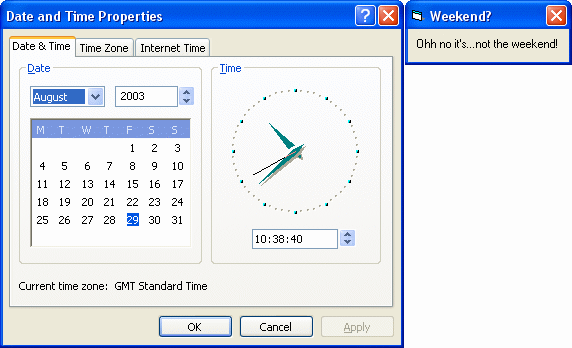

<div align="center">

## \[ If Statements, Weekend? \]


</div>

### Description

This will show beginners how to use simple If Statements why telling them if it's the weekend or not. Please leave your votes and comments :)
 
### More Info
 
Just place one Label into the form and just keep it's defalut name.

A message telling you if it is the weekend or not.


<span>             |<span>
---                |---
**Submitted On**   |
**By**             |[JamesJD](https://github.com/Planet-Source-Code/PSCIndex/blob/master/ByAuthor/jamesjd.md)
**Level**          |Beginner
**User Rating**    |4.3 (26 globes from 6 users)
**Compatibility**  |VB 3\.0, VB 4\.0 \(16\-bit\), VB 4\.0 \(32\-bit\), VB 5\.0, VB 6\.0
**Category**       |[Math/ Dates](https://github.com/Planet-Source-Code/PSCIndex/blob/master/ByCategory/math-dates__1-37.md)
**World**          |[Visual Basic](https://github.com/Planet-Source-Code/PSCIndex/blob/master/ByWorld/visual-basic.md)
**Archive File**   |[](https://github.com/Planet-Source-Code/jamesjd-if-statements-weekend__1-48068/archive/master.zip)


### Source Code

```
Private Sub Form_Load()
  If (Weekday(Now) = vbSaturday) Or (Weekday(Now) = vbSunday) Then
'This is the start of the If Statement telling the program that if it is
'Saturday or Sunday then print the message in Label1.
    Label1.Caption = "Don't worry it's only the weekend!"
'This is the message that will be printed in Label1.
  Else
'If the current date isn't Saturday or Sunday then it will go to the next message
'to print in Label1.
    Label1.Caption = "Ohh no it's...not the weekend!"
'This is the message that will be printed in Label1.
  End If
'This just ends the If Statement.
End Sub
```

